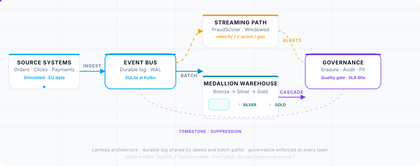
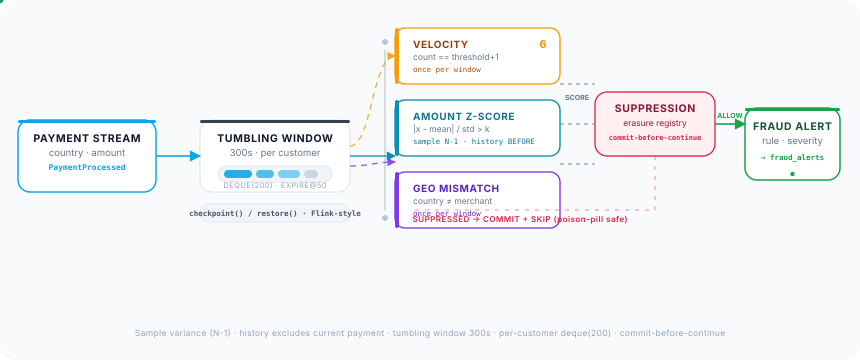

# EuroStream

**GDPR-compliant real-time analytics — Lambda on a laptop, production interfaces on deploy**

<p align="center">
  <a href="https://github.com/swadhinbiswas/eurostream/actions/workflows/ci.yml"></a>
  <a href="https://github.com/swadhinbiswas/eurostream/actions/workflows/orchestrate.yml"></a>
  
  
  
  <a href="LICENSE"></a>
</p>

<p align="center">
  <a href="https://eurostream-docs.pages.dev"><strong>Documentation</strong></a> ·
  <a href="#-quickstart">Quickstart</a> ·
  <a href="https://huggingface.co/datasets/swadhinbiswas/eustream">Live Lake</a>
</p>

<p align="center">
  
</p>

---

## Why this project exists

EU data work is judged on governance, not movement. GDPR Article 17 demands provable deletion, consent-correct aggregates, and auditable PII handling. Most portfolio pipelines demonstrate `Kafka → warehouse` and stop. EuroStream starts where they stop: the same Lambda pattern you would run in production, but implemented in pure Python so every decision is runnable, testable, and explainable on a laptop with zero cloud spend. Data governance is enforced at ingestion, at the warehouse boundary, and in CI — not described in a document.

## What it does and how it works

| Capability | How |
|---|---|
| **Ingestion** | Simulated EU sources — orders, clicks, payments with IBANs, country codes, consent flags, IPs — via `producers.py` (Faker) |
| **Event bus** | Durable log with topic offsets and consumer groups — `SqliteBus` (WAL, `BEGIN IMMEDIATE`) locally, `KafkaBus` (SASL_SSL / SCRAM on Aiven) in prod via `EUROSTREAM_EVENT_BUS_BACKEND` |
| **Streaming fraud** | `FraudScorer` with tumbling windows (300s), sample variance, history-excludes-current, checkpoint/restore; `FraudStreamProcessor` with suppression gate and commit-before-continue |
| **Warehouse** | Medallion on DuckDB — `Bronze` raw, `Silver` deduped + `arg_max` + SHA-256, `Gold` aggregated; full rebuild and watermarked incremental MERGE |
| **PII governance** | Pure-Python recognizers + ISO 13616 mod-97 IBAN check; `governance/pii_manifest.json` gate fails the DAG on unregistered PII |
| **Erasure** | Six-layer Art. 17 cascade → tamper-evident audit `sha256(id:customer)[:16]`, SLA measured end-to-end |
| **Quality & contracts** | DAG-failing checks + Pydantic schema snapshots with full compatibility policy (CI fails on breaking drift) |

The demo ties it together:

```bash
uv sync && uv run eurostream demo
# produce → fraud scorer → Bronze load → DAG (pii_scan → silver → gold → quality → lake) → erasure → verification
```

```
5/6 verifying cascade...
  bronze PII anonymized rows: 60 (before: 60 clear-text)
  gold customer_360 rows remaining: 0 (expect 0)
  audit log entries: 1 (expect 1)
  verification: PASSED
```

## Why it is better than existing solutions

| Typical portfolio pipeline | EuroStream |
|---|---|
| Moves data, asserts row counts | Enforces governance — erasure is a 6-layer transaction with durable suppression and DB-first audit |
| Regex-only PII, misses UUID look-alikes | mod-97 checksum — `DE89…` passes, `550e8400-e29b-…` correctly rejected |
| Schema drift found in production | Drift blocked in CI — snapshot vs `governance/contracts.json` fails on new required / optional→required / type change |
| One-shot warehouse build | Full rebuild *and* watermarked incremental (`--incremental`) — same correctness, ~90% less work at scale |
| Silent data loss on replay | `INSERT OR IGNORE` on `event_id` PK + `commit`-before-`continue` poison-pill safety |
| Docs describe compliance | Code enforces it — manifest gate, mirror checks with negative tests, lineage JSONL |

## Architecture

<p align="center">
  
</p>

Lambda: speed path for seconds, batch path for truth, shared durable log, no shared state.

| Layer | Content | PII policy |
|---|---|---|
| **Bronze** | Raw events exactly as ingested | Clear text — set to `<anonymized>` on erasure |
| **Silver** | Deduplicated (`row_number` on natural key), typed, customer dimension | Salted SHA-256 (`PII_SALT`), `arg_max(..., occurred_at)` latest-wins |
| **Gold** | `customer_360`, `order_facts`, `fraud_summary` | Never sees raw PII; marketing gated on `marketing_consent` |

Event bus is behind `Producer`/`Consumer`. The warehouse is standard SQL. Swapping to MSK / Snowflake / Turso is a config change.

### How fraud is caught

<p align="center">
  
</p>

* **Velocity** — `count == threshold+1` once per tumbling window per customer (prevents alert spam)
* **Amount z-score** — `|x - mean| / std > k` over history *before* the current payment, sample variance (N-1), bounded `deque(200)` + `expire()` every 50 events
* **Geo mismatch** — `country != merchant_country` once per window
* All alerts gated by the erasure suppression registry and persisted via checkpoint/restore for Flink-style recovery

## How it solves the problem

**GDPR as code, not paperwork:**

1. `POST /erasure-requests` enqueues a tombstone (`event_id == request_id` — one identity) on `erasure_requests`
2. Worker executes in order: **Suppression** (in-memory + durable table so other processes see it) → **Bronze anonymize** (rows survive, PII gone) → **Silver/Gold DELETE** → **Alerts purge** → **Lake re-snapshot** (HF dataset `swadhinbiswas/eustream`)
3. Audit is written **DB first, then JSONL** (DB is transactional source of truth, file is rebuildable)
4. Latency is `completed_at - requested_at` (includes queue time) against `EUROSTREAM_ERASURE_SLA_SECONDS=60`; breach increments a counter scraped at `/metrics/prometheus`

**Consent and PII:** `marketing_consent` flows Bronze → Silver (`bool_and` so one opt-out wins) → Gold `consents_marketing` mirror, verified by `consents_marketing <> marketing_consent` plus a negative test that corrupts Gold. PII columns are hashed once with `PII_SALT` — SQL `sha256(salt:arg_max)` and Python `hash_pii` agree byte-for-byte.

## About data

* **Source:** fully synthetic EU data (Faker `de_DE`/`fr_FR`/`nl_NL`) — IBANs, country codes, IPs, consent flags. No real PII, no external dependencies.
* **Volume:** demo uses 60+60 customers, ~120 events; `orchestrate.yml` produces 1k per run every 5h and via incremental keeps the lake fresh.
* **Lake:** `data/lake/silver/*.parquet` + `gold/*.parquet` — **only** de-identified layers; Bronze never leaves the governed boundary. Public lake at [`huggingface.co/datasets/swadhinbiswas/eustream`](https://huggingface.co/datasets/swadhinbiswas/eustream).
* **Quality:** `governance.data_quality_runs` records every check run for audit history; `lineage.jsonl` records inputs/outputs per DAG task.

## Technical details

* **Python 3.11+**, `uv`, `pydantic`/`pydantic-settings` (`EUROSTREAM_*`), `duckdb`, `fastapi`/`uvicorn`, `typer`, `Faker`, `confluent-kafka` (optional), `huggingface_hub`
* **Type-checked:** `mypy --strict` (20 files), **Linted:** `ruff` + `ruff format`, **Tested:** 49 tests across 10 suites, each mapping to a guarantee, **Contract-checked:** `eurostream contracts --baseline`
* **CI:** `ci.yml` runs lint + typecheck + tests + contract + Docker smoke (full demo inside the built image) + docs build on every push/PR

**Testing guarantees include:** mod-97 IBAN rejection, velocity/geo once-per-window, suppression gating, erasure end-to-end + durable suppression + tombstone identity, hash parity SQL↔Python, bus offsets/groups/replay, DAG cycle/retry, metrics rendering, API contract, incremental watermarks, lineage + checkpoint.

## Self-hosted

**Local (zero infra):**

```bash
uv sync && uv run eurostream demo
```

**Docker (prod parity):**

```bash
docker build -t eurostream . && docker compose up -d   # non-root, healthcheck, demo smoke inside image
```

**Individual commands:**

```bash
uv run eurostream produce --events 100
uv run eurostream stream --max-events 50
uv run eurostream transform                 # full
uv run eurostream transform --incremental   # watermarked
uv run eurostream erase cust_424242
uv run eurostream worker                    # long-running erasure worker
```

**Free live stack (as deployed):**

| Target | Service | Config |
|---|---|---|
| Docs | Cloudflare Pages | `site/` Astro Starlight, `wrangler.toml` + `_headers` |
| Lake | Hugging Face Dataset `swadhinbiswas/eustream` (public Parquet) | `HF_TOKEN`, `hf upload` in `orchestrate.yml` |
| Bus | Aiven free Kafka (SASL_SSL / SCRAM) | `EUROSTREAM_KAFKA_BOOTSTRAP_SERVERS=...aivencloud.com:12490` |
| Warehouse | Single Turso `libsql://` (or DuckDB file) | `TURSO_DATABASE_URL` / `TURSO_AUTH_TOKEN` |
| API | HF Space / Render (Docker, `:7860`) | `EUROSTREAM_PII_SALT` from secrets |
| Orchestration | GitHub Actions `orchestrate.yml` every 5h + on push | 1k events → incremental → HF upload; auto-creates topics |

Same application code — `EUROSTREAM_EVENT_BUS_BACKEND` and `WAREHOUSE_PATH` select the adapter.

**Configuration:** all `EUROSTREAM_*` env vars (see `.env.example` and `site/src/content/docs/reference/configuration.mdx`), also reads `.env`.

**API:**

| Endpoint | Method | Purpose |
|---|---|---|
| `/erasure-requests` | POST | `{customer_id}` → `request_id` |
| `/health` | GET | `suppressed` count |
| `/metrics` | GET | JSON snapshot |
| `/metrics/prometheus` | GET | `text/plain` for Grafana |
| `/governance/erasure-audit` | GET | Audit rows |
| `/gold/customer-360` | GET | `?limit` capped at 1000 |

```bash
uv run uvicorn eurostream.api:app --reload --port 7860
curl -X POST http://localhost:7860/erasure-requests -H "Content-Type: application/json" -d '{"customer_id":"cust_123"}'
```

## Design decisions

| ADR | Decision | Rationale |
|---|---|---|
| [0001](docs/adr/0001-eu-region-choice.md) | EU residency `eu-central-1` | GDPR + German FADP require EU storage/processing |
| [0002](docs/adr/0002-event-bus.md) | SQLite + Kafka interface | Zero-deps local, 1-var prod swap |
| [0003](docs/adr/0003-pii-classification.md) | Pure-Python recognizers | No model downloads, auditable, mod-97 IBAN |

Full rationale: [`docs/rfc/0001-platform-design.md`](docs/rfc/0001-platform-design.md) + postmortem `inc-2026-001`. The project optimizes for **interfaces over infrastructure** — every swap is config + adapter, not a rewrite — and for a system that is small enough to fully explain and complete enough to be real.

---

### License

[MIT](LICENSE)
