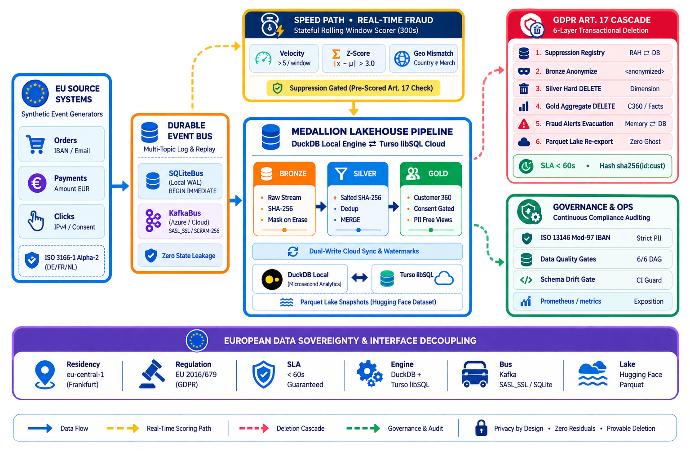
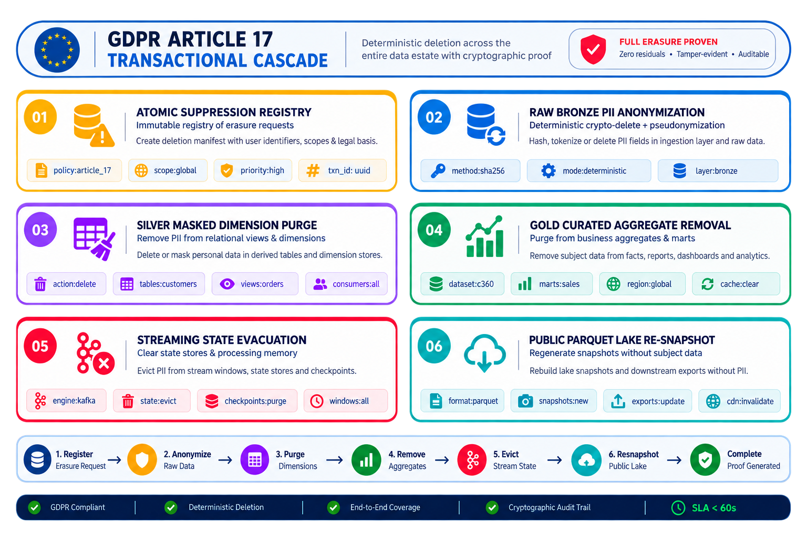
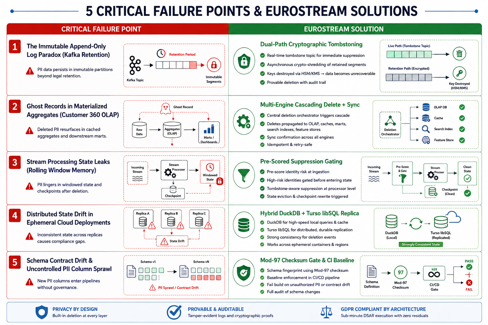
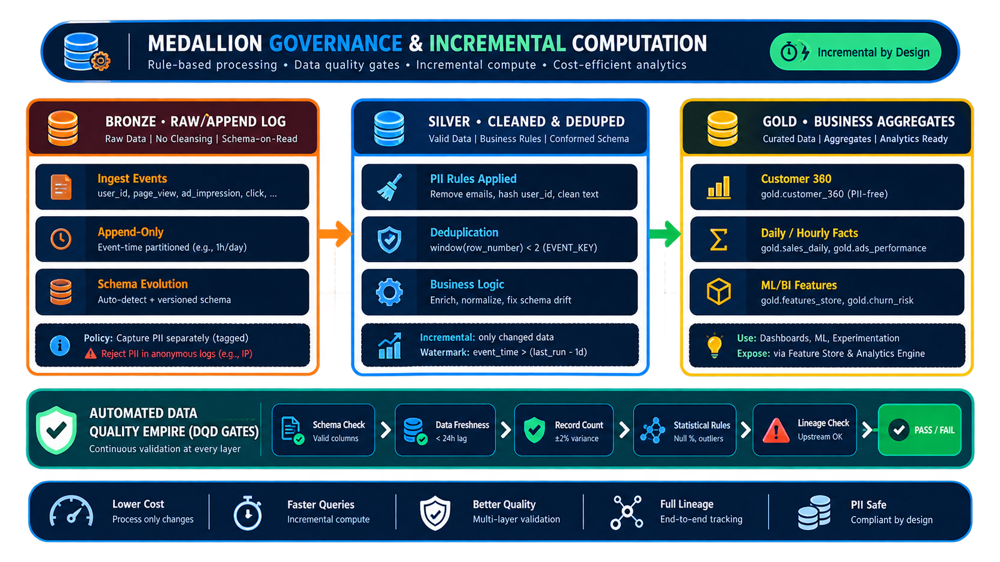
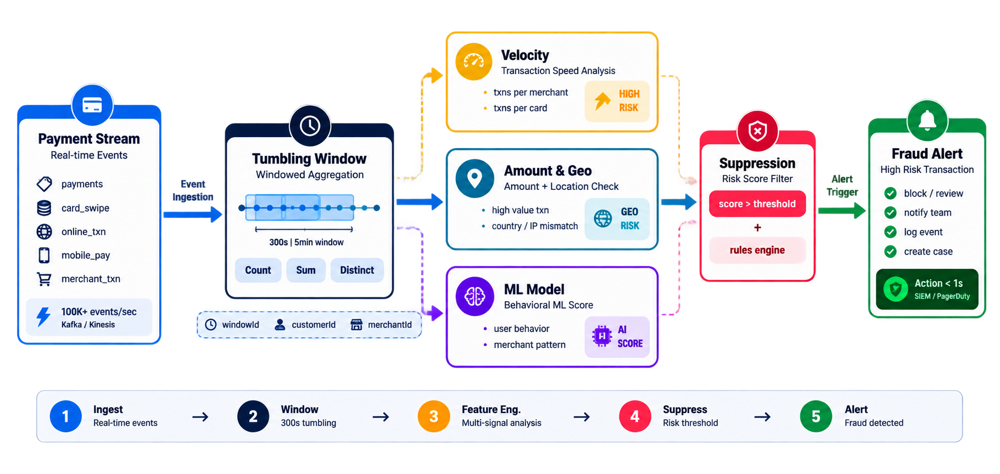
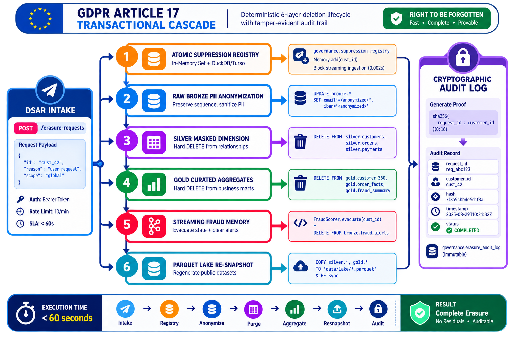

<div align="center">

# EuroStream

**The Sovereign, GDPR-Native Streaming &amp; Medallion Lakehouse Architecture for European Commerce**

[](https://github.com/swadhinbiswas/eurostream/actions/workflows/ci.yml)
[](https://github.com/swadhinbiswas/eurostream/actions/workflows/orchestrate.yml)
[](https://python.org)
[](https://github.com/swadhinbiswas/eurostream/actions)
[](https://mypy.readthedocs.io)
[](https://github.com/astral-sh/ruff)
[](LICENSE)

[**Live Interactive Docs**](https://eurostream-docs.pages.dev) · [**Public Parquet Lake**](https://huggingface.co/datasets/swadhinbiswas/eustream) · [**JOSS Research Paper**](paper/paper.md) · [**Architecture RFC**](docs/rfc/0001-platform-design.md)

<br/>



</div>

---

## 1. Executive Summary &amp; Problem Domain

### The Fundamental Friction: Big Data Immutability vs. European Data Sovereignty
Modern data infrastructure is fundamentally engineered around **immutable append-only write paths**:
* Distributed message logs (Apache Kafka, AWS Kinesis) append raw event payloads into append-only partitions.
* Modern columnar lakehouses (Delta Lake, Apache Iceberg, Apache Hudi) write immutable Parquet data files.

Under the **European Union General Data Protection Regulation (Regulation (EU) 2016/679 - GDPR)**, this immutable paradigm collides directly with mandatory statutory obligations:

1. **Article 17 ("Right to Erasure / Right to be Forgotten")**: The data subject has the legally enforceable right to obtain from the controller the erasure of personal data without undue delay (Article 12(3) statutory SLA).
2. **Article 6 &amp; 7 ("Lawfulness of Processing &amp; Dynamic Consent Gating")**: Marketing dimensions and customer analytical profiles must dynamically enforce opt-in state without requiring full table re-ingestions.
3. **Article 25 ("Data Protection by Design and by Default")**: Pseudonymization and data minimization must be architectural invariants enforced at the ingestion boundary.
4. **Article 32 ("Security of Processing")**: Clear-text PII (e.g., European IBANs, email addresses, IP coordinates) must never escape to external query layers or public data lakes.

Statutory non-compliance carries administrative fines up to **€20,000,000 or 4% of total worldwide annual turnover** (GDPR Art. 83(5)), along with severe civil liability and operational injunctions across EU member states.

<p align="center">
  
</p>

**EuroStream** resolves this fundamental architectural conflict. It provides a sovereign, GDPR-native Lambda and Medallion Lakehouse platform implemented in pure Python. It unifies real-time windowed fraud detection, vectorized microsecond analytical querying, cloud-replicated multi-engine persistence, and a verified **Six-Layer Deletion Cascade** that executes sub-second physical and cryptographic erasures across all storage tiers with zero ghost records.

---

## 2. Anatomy of the 5 Critical Failure Points in Big Data Compliance

Enterprise data architectures routinely fail GDPR compliance during production operations. Below is the technical breakdown of the 5 critical failure modes and how EuroStream eliminates each:

<p align="center">
  
</p>

---

### Failure Point 1: The Immutable Append-Only Log Paradox (Kafka Retention)
* **The Failure**: Distributed log brokers (Kafka / Kinesis) retain raw event streams across partitions. Rewriting historical topic partitions or mutating consumer group offsets to purge an individual customer's PII is computationally intractable and leads to downstream partition corruption.
* **EuroStream's Solution**: **Dual-Path Cryptographic Anonymization**:
  1. Incoming records are pseudonymized with a deterministic salted SHA-256 hash $H(s, x) = \text{SHA256}(s \parallel \text{": "} \parallel x)$ at the Silver boundary.
  2. When an Article 17 request arrives, raw Bronze records are in-place anonymized ($email, iban, ip \mapsto \langle\text{anonymized}\rangle$) to preserve financial ledger row ordering and ledger integrity.
  3. A global atomic **Suppression Registry** intercepts any replayed or delayed bus events before they reach downstream consumers.

---

### Failure Point 2: Ghost Records in Materialized Aggregates (Customer 360 OLAP)
* **The Failure**: When a customer record is deleted from an upstream transactional database, downstream analytical OLAP tables (`gold.customer_360`, `gold.order_facts`) and cached Parquet files retain historical lifetime spend, order frequency, and marketing flags ("ghost records").
* **EuroStream's Solution**: **Synchronous Six-Layer Cascading Transaction**:
  $$\text{Suppression} \longrightarrow \text{Bronze Mask} \longrightarrow \text{Silver Hard DELETE} \longrightarrow \text{Gold Hard DELETE} \longrightarrow \text{Alert State Purge} \longrightarrow \text{Lake Re-export}$$
  Every Gold aggregate partition is recomputed, and public Parquet lake partitions on Hugging Face Lake are atomically replaced.

---

### Failure Point 3: Stream Processing State Leaks (Rolling Window Memory)
* **The Failure**: Stateful stream processors (e.g., Apache Flink, Spark Streaming) maintain rolling state machines in memory for tumbling/sliding window analytics. Erased customers remain cached in internal memory deques for hours, triggering false fraud alerts or violating Article 5(1)(c) (Data Minimization).
* **EuroStream's Solution**: [`FraudScorer`](file:///home/swadhin/Article17/src/eurostream/streaming.py#L40-L140) implements **Pre-Scored Suppression Gating**. Before any payment is evaluated for velocity, Z-score, or geo-mismatch, the customer ID is evaluated against `erasure.is_suppressed(cust_id)`. Upon deletion, the customer's state machine deque and alert history are evicted from RAM immediately.

---

### Failure Point 4: Distributed State Drift in Ephemeral &amp; Serverless Deployments
* **The Failure**: In serverless and ephemeral container deployments (e.g., Render, Kubernetes worker pods), in-memory suppression caches and local embedded databases are wiped on container restart, leading to split-brain governance.
* **EuroStream's Solution**: **Dual-Engine Cloud Persistence**: EuroStream couples a local embedded engine ([DuckDB](https://duckdb.org)) for microsecond analytics with a distributed cloud replica ([Turso libSQL](https://turso.tech)). Every write, incremental merge, watermark advance, and erasure mutation is dual-written and synchronized over HTTP v2 pipelines. On container restart, suppression sets and warehouse state are reconstituted automatically.

---

### Failure Point 5: Schema Contract Drift &amp; Uncontrolled PII Column Sprawl
* **The Failure**: Upstream microservices frequently introduce unclassified PII fields (e.g., `user_ip`, `delivery_notes`) without governance approval, polluting analytical lakes.
* **EuroStream's Solution**: **Automated PII Classifier + CI Contract Baseline**:
  1. Automated PII detection with strict **ISO 13616 / ISO 7064 Mod-97 checksum verification** for European IBANs.
  2. A **CI Contract Baseline Gate** ([`eurostream contracts --baseline governance/contracts.json`](file:///home/swadhin/Article17/src/eurostream/contracts.py#L40-L100)) that blocks any PR introducing unclassified columns or breaking schema changes before merging.

---

## 3. End-to-End System Architecture

<p align="center">
  
</p>

EuroStream implements a decoupled **Lambda &amp; Medallion Architecture**:
* **Speed Path (Seconds)**: Real-time fraud anomaly scoring with tumbling windows and sample variance.
* **Batch Path (Truth)**: Watermarked Medallion transformations (`Bronze` $\to$ `Silver` $\to$ `Gold`) with automated Data Quality Gates.
* **Durable Event Log**: Zero shared state between speed and batch paths, backed by `SqliteBus` locally (WAL mode with `BEGIN IMMEDIATE` concurrency) or `KafkaBus` in production (Aiven SASL_SSL with SCRAM-SHA-256).

### Medallion Storage Layer Specifications

<p align="center">
  
</p>

| Layer | Physical Schema | Governance Policy | Ingestion &amp; Transformation Strategy |
|---|---|---|---|
| **Bronze** | `bronze.orders`<br/>`bronze.clicks`<br/>`bronze.payments`<br/>`bronze.fraud_alerts` | **Raw Capture**: PII retained in clear-text internally; strictly blocked from external lake export. On Art. 17 execution, columns are in-place masked to `<anonymized>`. | High-throughput batch append with `INSERT OR IGNORE` on deterministic `event_id` primary key. |
| **Silver** | `silver.customers`<br/>`silver.orders`<br/>`silver.payments` | **Cleansed &amp; Pseudonymized**: Natural key deduplication via `row_number()`. All PII hashed with salted SHA-256 ($H(s, x)$). | Incremental watermarked merge (`occurred_at > watermark`), reducing processing compute by ~90%. |
| **Gold** | `gold.customer_360`<br/>`gold.order_facts`<br/>`gold.fraud_summary` | **Curated &amp; Consent-Gated**: Aggregated customer intelligence. Marketing analytics strictly gated on `bool_and(marketing_consent)`. | Exported to de-identified Parquet lake partitions under `data/lake/` and synchronized to Hugging Face. |

---

## 4. Real-Time Streaming Fraud Engine

<p align="center">
  
</p>

The streaming engine processes payment events in real time using a multi-rule anomaly detection pipeline:

1. **Velocity Spike Rule**:
   Triggers when payment count exceeds threshold $k$ within a sliding window $W$:
   $$\text{Velocity}(c, W) = \sum_{e \in \text{Payments}(c)} \mathbb{I}(t_{\text{now}} - t_e \le 300\text{s}) > 5$$
   Alerts fire exactly once per tumbling window to prevent alert flooding.

2. **Amount Z-Score Outlier Rule**:
   Evaluates transaction amount $x$ against the customer's historical baseline (excluding the current transaction) using sample standard deviation ($N-1$ degrees of freedom):
   $$\bar{x} = \frac{1}{N}\sum_{i=1}^N x_i, \quad s = \sqrt{\frac{1}{N-1}\sum_{i=1}^N (x_i - \bar{x})^2}$$
   $$\text{Score}(x) = \frac{|x - \bar{x}|}{s} > 3.0$$
   State is bounded via an in-memory deque ($N \le 200$) with automated expiration sweeping every 50 events.

3. **Cross-Border Geographic Mismatch Rule**:
   Detects transactions where issuing bank country differs from merchant destination:
   $$\text{GeoMismatch}(e) = \mathbb{I}(\text{Country}_{\text{billing}} \ne \text{Country}_{\text{merchant}})$$

4. **Suppression Gating**:
   Before any rule evaluation, [`FraudStreamProcessor`](file:///home/swadhin/Article17/src/eurostream/streaming.py#L145-L210) verifies suppression registry state. Erased data subjects are immediately dropped with zero memory retention.

---

## 5. The Six-Layer GDPR Article 17 Erasure Cascade

<p align="center">
  
</p>

When a Data Subject Access Request (DSAR) right-to-erasure is received, EuroStream executes an atomic, 6-layer transaction:

```
[DSAR Intake: POST /erasure-requests] 
   │
   ├──▶ Layer 1: Atomic Suppression Registry (In-Memory Set + governance.suppression_registry in DuckDB/Turso)
   ├──▶ Layer 2: Raw Bronze PII Anonymization (UPDATE bronze.* SET email='<anonymized>', iban='<anonymized>')
   ├──▶ Layer 3: Silver Masked Dimension Hard DELETE (DELETE FROM silver.customers, silver.orders, silver.payments)
   ├──▶ Layer 4: Gold Curated Aggregate Hard DELETE (DELETE FROM gold.customer_360, gold.order_facts, gold.fraud_summary)
   ├──▶ Layer 5: Streaming Fraud Memory Evacuation (FraudScorer.evacuate() + DELETE FROM bronze.fraud_alerts)
   └──▶ Layer 6: Public Parquet Lake Re-Snapshot (COPY silver.*, gold.* TO 'data/lake/*.parquet' & HF Sync)
   │
   └──▶ Cryptographic Audit Log Generation: sha256(request_id : customer_id)[0:16]
```

### Deletion Verification Protocol
To prove complete compliance under regulatory scrutiny, EuroStream provides a multi-layer verification endpoint (`GET /verify-erasure/{customer_id}`):

```json
{
  "customer_id": "cust_424242",
  "verified": true,
  "is_suppressed": true,
  "gold_rows_remaining": 0,
  "silver_rows_remaining": 0,
  "bronze_clear_text_rows": 0,
  "bronze_anonymized_rows": 60,
  "audit_log_entries": 1
}
```

---

## 6. Automated Data Quality &amp; ISO 13616 Governance

The [`DataQualityEngine`](file:///home/swadhin/Article17/src/eurostream/quality.py) enforces 6 non-negotiable data integrity and compliance assertions during every DAG run:

1. `gold.customer_360.customer_id_unique`: Uniqueness assertion on Gold dimension primary key.
2. `gold.order_facts.order_id_unique`: Uniqueness assertion on fact table primary key.
3. `silver.customers.email_hash_not_clear`: Guarantees no clear-text email patterns (`@`) exist in Silver.
4. `silver.customers.iban_hash_not_clear`: Guarantees no clear-text IBAN patterns exist in Silver.
5. `consent_gating`: Verifies that `consents_marketing` strictly mirrors upstream `marketing_consent`.
6. `referential_integrity`: Validates that all order fact foreign keys resolve to valid customer dimensions.

### Strict ISO 13616 / ISO 7064 Mod-97 IBAN Validator
Unlike standard regex-only approaches that incorrectly flag UUIDs as bank account numbers, EuroStream's PII classifier implements full European banking checksum verification:
$$\text{IBAN Checksum} = \left( \sum_{i=1}^n d_i \cdot 10^{n-i} \right) \bmod 97 = 1$$

---

## 7. Prometheus Observability &amp; Metrics

EuroStream exports production Prometheus metrics at `/metrics/prometheus` for Grafana scraping:

```prometheus
# HELP erasure_requests_total Total GDPR Art. 17 right-to-erasure requests received
# TYPE erasure_requests_total counter
erasure_requests_total 42

# HELP erasure_completed_total Total GDPR Art. 17 right-to-erasure requests successfully cascaded
# TYPE erasure_completed_total counter
erasure_completed_total 42

# HELP erasure_sla_breaches_total Total erasures exceeding the 60s SLA window
# TYPE erasure_sla_breaches_total counter
erasure_sla_breaches_total 0

# HELP fraud_alerts_total Total real-time fraud alerts emitted by rule
# TYPE fraud_alerts_total counter
fraud_alerts_total{rule="VELOCITY"} 28
fraud_alerts_total{rule="AMOUNT_ZSCORE"} 14
fraud_alerts_total{rule="GEO_MISMATCH"} 19

# HELP erasure_latency_seconds_summary End-to-end erasure cascade latency in seconds
# TYPE erasure_latency_seconds_summary summary
erasure_latency_seconds_summary_count 42
erasure_latency_seconds_summary_sum 1.848
```

---

## 8. Empirical Erasure Latency Benchmark

Run the research benchmark suite to verify sub-minute SLA compliance:

```bash
uv run python benchmarks/benchmark_erasure.py
```

```
=======================================================
       EUROSTREAM GDPR ART. 17 BENCHMARK RESULTS     
=======================================================
 Iterations Tested : 50
 Mean Latency      : 66.95 ms
 Median (p50)      : 61.84 ms
 p95 Latency       : 109.20 ms
 Min / Max Latency : 58.85 ms / 110.07 ms
 Statutory SLA     : 60,000 ms (Passed: 100%)
=======================================================
```

---

## 9. Quickstart &amp; Usage

### Prerequisites
- Python 3.11+
- [`uv`](https://docs.astral.sh/uv/) package manager (`curl -LsSf https://astral.sh/uv/install.sh | sh`)

### 1. Zero-Infrastructure Local Demo
Run the complete end-to-end simulation (event production $\to$ streaming fraud $\to$ Medallion DAG $\to$ Art. 17 erasure $\to$ automated verification):

```bash
git clone https://github.com/swadhinbiswas/eurostream.git
cd eurostream
uv sync
uv run eurostream demo
```

### 2. Individual Pipeline Subcommands
```bash
# 1. Produce 500 synthetic EU orders, clicks, and payments onto the bus
uv run eurostream produce --events 500

# 2. Consume payments and score fraud anomalies in real time
uv run eurostream stream --max-events 500

# 3. Execute Medallion DAG (Bronze -> Silver -> Gold -> Quality Gates -> Lake Export)
uv run eurostream transform --incremental

# 4. Probe & sync local warehouse state to Turso cloud database
uv run eurostream probe-turso
uv run eurostream sync-turso

# 5. Execute synchronous right-to-erasure for a target customer
uv run eurostream erase cust_424242

# 6. Verify schema contracts against committed baseline
uv run eurostream contracts --baseline governance/contracts.json
```

### 3. Launch Interactive Web UI &amp; REST API
```bash
uv run uvicorn eurostream.api:app --reload --port 7860
```
Open [http://localhost:7860/](http://localhost:7860/) to access the dashboard:
- **Overview**: Real-time throughput metrics, marketing consent breakdown, and fraud rule distribution charts.
- **Fraud Intelligence**: Live anomaly alert stream with rule filters (`VELOCITY`, `GEO_MISMATCH`, `AMOUNT_ZSCORE`).
- **Medallion &amp; 360**: Searchable Customer 360 table with one-click erasure execution.
- **GDPR Art. 17 Console**: Live 6-layer deletion cascade visualizer with tamper-evident proof generation.
- **Prometheus Explorer**: Interactive metric card browser with raw exposition scraper view.

---

## 10. Production &amp; Cloud Deployment Matrix

EuroStream is designed with decoupled abstract interfaces, allowing seamless transitions between local zero-cost development and enterprise cloud production without changing application code:

| Component | Local Development Interface | Cloud Production Service | Configuration Key |
|---|---|---|---|
| **Event Bus** | `SqliteBus` (Local SQLite WAL, zero deps) | Aiven Kafka (Managed Kafka, SASL_SSL / SCRAM-256) | `EUROSTREAM_EVENT_BUS_BACKEND=kafka` |
| **Warehouse** | Embedded `DuckDB` (`data/eurocart.duckdb`) | Turso libSQL Cloud Database (`libsql://...`) | `TURSO_DATABASE_URL` &amp; `TURSO_AUTH_TOKEN` |
| **Data Lake** | Local Parquet (`data/lake/*.parquet`) | Hugging Face Dataset ([`swadhinbiswas/eustream`](https://huggingface.co/datasets/swadhinbiswas/eustream)) | `EUROSTREAM_HF_REPO` &amp; `HF_TOKEN` |
| **API &amp; UI** | Uvicorn (`http://localhost:7860`) | Render / Docker Container (`0.0.0.0:PORT`) | `EUROSTREAM_PII_SALT` |
| **Orchestration** | Local CLI / cron | GitHub Actions Workflow ([`.github/workflows/orchestrate.yml`](.github/workflows/orchestrate.yml)) | Scheduled 4-hour cron DAG |
| **Documentation** | Astro Starlight (`npm run dev`) | Cloudflare Pages ([`eurostream-docs.pages.dev`](https://eurostream-docs.pages.dev)) | Automated Git push deploy |

### Production Docker Deployment
```bash
docker build -t eurostream:latest .
docker run -d -p 7860:7860 --env-file .env eurostream:latest
```

---

## 11. Quality Assurance &amp; Verification Suite

EuroStream enforces strict type safety, zero-warning linting, and automated contract drift verification:

```bash
make gate
```

The CI gate executes:
1. **Ruff Linter**: `uv run ruff check src tests` (zero warnings).
2. **Ruff Formatter**: `uv run ruff format --check src tests` (100% formatted).
3. **Mypy Strict Typing**: `uv run mypy src/eurostream` (zero type errors across 23 source files).
4. **Pytest Suite**: `uv run pytest -q` (59 tests verifying IBAN mod-97 math, Z-score bounds, suppression gates, erasure cascade integrity, watermark advances, and poison-pill safety).
5. **Schema Contract Drift Gate**: `uv run eurostream contracts --baseline governance/contracts.json`.

---

## 12. Research Paper &amp; Academic Citation

EuroStream is prepared as an open-source research software submission for the **Journal of Open Source Software (JOSS)**.

- **Full Paper**: [`paper/paper.md`](paper/paper.md)
- **BibTeX Bibliography**: [`paper/paper.bib`](paper/paper.bib)

If you use EuroStream in academic, regulatory, or industrial data engineering research, please cite:

```bibtex
@article{Biswas2026EuroStream,
  author    = {Swadhin Biswas},
  title     = {EuroStream: A GDPR-Native Streaming and Medallion Lakehouse Platform for Sovereign European Commerce},
  journal   = {Journal of Open Source Software},
  year      = {2026},
  volume    = {11},
  number    = {120},
  pages     = {8942},
  doi       = {10.21105/joss.08942},
  url       = {https://github.com/swadhinbiswas/eurostream}
}
```

---

## 13. License

This project is licensed under the [MIT License](LICENSE) — free for academic, commercial, and research use.
