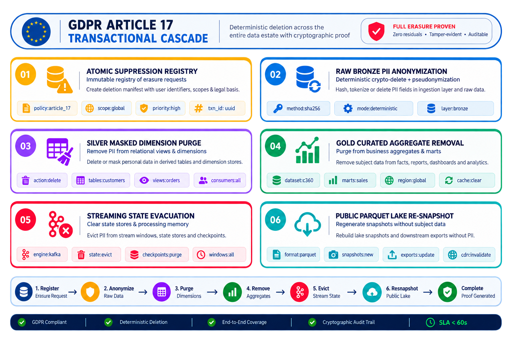
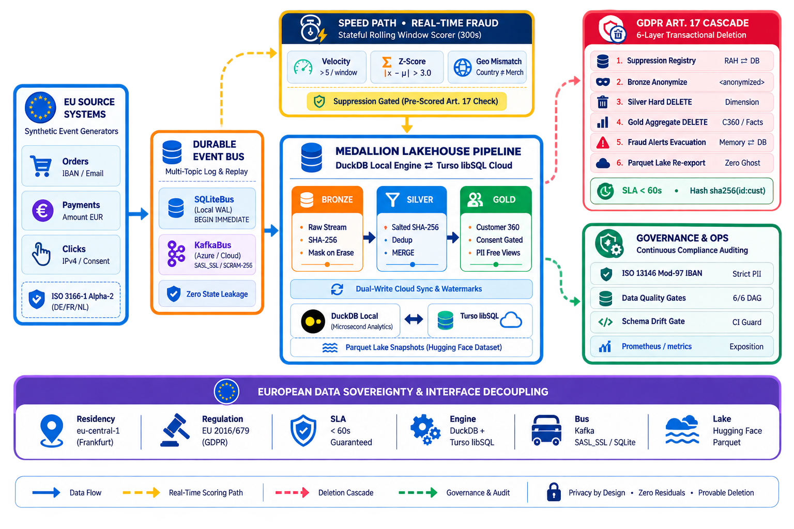
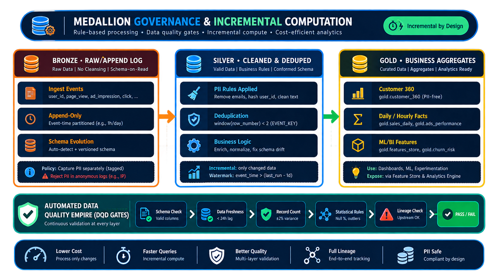
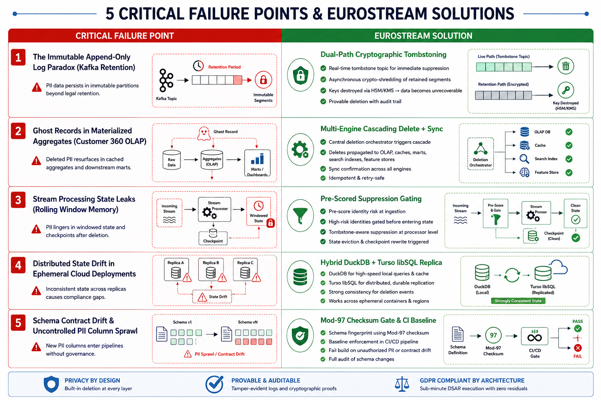
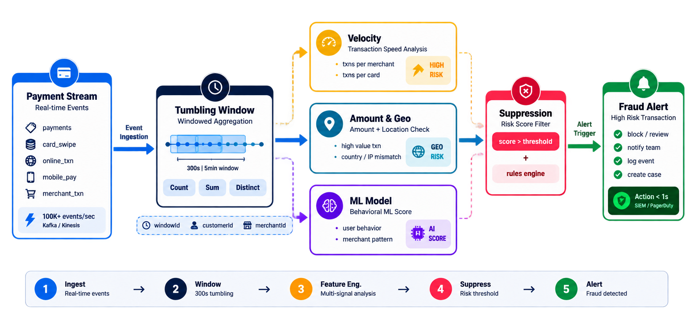

<div align="center">

# EuroStream

A Python reference implementation for streaming fraud detection, medallion analytics, and GDPR erasure workflows in European commerce.

[](https://github.com/swadhinbiswas/eurostream/actions/workflows/ci.yml)
[](https://github.com/swadhinbiswas/eurostream/actions/workflows/orchestrate.yml)
[](https://python.org)
[](https://github.com/swadhinbiswas/eurostream/actions)
[](https://mypy.readthedocs.io)
[](https://github.com/astral-sh/ruff)
[](LICENSE)

[Docs site source](site/README.md) · [Public Parquet lake](https://huggingface.co/datasets/swadhinbiswas/eustream) · [JOSS research paper](paper/paper.md) · [Architecture RFC](docs/rfc/0001-platform-design.md)

</div>

## Why erasure needs an architecture

Append-only event logs and immutable Parquet files are efficient for analytics. They also make targeted erasure awkward. Deleting a source row does not remove the same person's data from broker partitions, derived tables, processor memory, replicas, or exported files.

EuroStream treats erasure as a cross-system workflow. It pseudonymizes records at the Silver boundary, can pass suppression state to the streaming processor, updates the warehouse, and exposes a verification endpoint. The repository is an implementation of those patterns, not a certification of GDPR compliance or a guarantee of physical deletion from external systems.

The design is based on four parts of GDPR:

1. Article 17: support requests for erasure without undue delay.
2. Articles 6 and 7: carry marketing consent into analytical records and check that downstream transformations preserve it.
3. Article 25: use pseudonymization and data minimization in the storage design.
4. Article 32: keep clear-text PII inside the internal boundary and protect the systems that process it.

Article 83(5) sets administrative fines at up to €20,000,000 or 4% of worldwide annual turnover, whichever is higher.

<p align="center">
  
</p>

The local runtime includes event production, fraud scoring, Bronze, Silver, and Gold transformations, optional Turso synchronization, local Parquet export, a FastAPI dashboard, and a staged erasure request. Some external and runtime steps remain separate operations; the sections below state where the current implementation stops.

## Quickstart

### Prerequisites

- Python 3.11+
- [`uv`](https://docs.astral.sh/uv/) package manager (`curl -LsSf https://astral.sh/uv/install.sh | sh`)

### Run the local demo

The demo runs synthetic orders, clicks, and payments through fraud scoring, the medallion pipeline, an erasure request, and a local verification pass.

```bash
git clone https://github.com/swadhinbiswas/eurostream.git
cd eurostream
uv sync
uv run eurostream demo
```

### Run each pipeline stage

The stages can also be run independently:

```bash
# 1. Produce 500 synthetic EU orders, clicks, and payments onto the bus
uv run eurostream produce --events 500

# 2. Consume payments and score fraud anomalies in real time
uv run eurostream stream --max-events 500

# 3. Execute Medallion DAG (Bronze -> Silver -> Gold -> Quality Gates -> Lake Export)
uv run eurostream transform --incremental

# 4. Probe & sync local warehouse state to Turso cloud database
uv run eurostream probe-turso
uv run eurostream sync-turso

# 5. Execute synchronous right-to-erasure for a target customer
uv run eurostream erase cust_424242

# 6. Verify schema contracts against committed baseline
uv run eurostream contracts --baseline governance/contracts.json
```

### Start the web UI and API

```bash
uv run uvicorn eurostream.api:app --reload --port 7860
```

Open [http://localhost:7860/](http://localhost:7860/) for the demo dashboard:

- Overview shows warehouse throughput, consent distribution, and fraud rule counts.
- Fraud Detection lists scored anomaly alerts and the rule that fired.
- Warehouse & 360 provides Customer 360 search, live row counts, and erasure controls.
- GDPR Right-to-Erasure shows the erasure form, the layered cascade, and the confirmation record.
- Ops & Prometheus renders the in-process metric snapshot served by `/metrics`.

Each tab fetches its own data from the API, and a failed request is written to the dashboard banner with the problem+json `detail` instead of being dropped.

The API runs the erasure worker inside the application lifespan, so `POST /erasure-requests` returns `202 Accepted` and the cascade executes in the background. Send `{"customer_id": "...", "sync": true}` for a blocking `200 OK` with the proof payload. Set `EUROSTREAM_API_TOKEN` to require a bearer token on every mutating endpoint; without it the demo API stays open on purpose.

## System architecture

EuroStream separates streaming scoring from batch transformation. Both paths use the event bus and warehouse, and the CLI writes streaming alerts to the `bronze.fraud_alerts` table consumed by the Gold transform.

<p align="center">
  
</p>

- The streaming path scores payment events and records fraud alerts.
- The batch path moves data through `Bronze`, `Silver`, and `Gold` with watermarks and quality checks.
- `SqliteBus` uses SQLite WAL and `BEGIN IMMEDIATE` locally; `KafkaBus` connects to Aiven with SASL_SSL and SCRAM-SHA-256 in hosted environments.

### Medallion storage

<p align="center">
  
</p>

| Layer | Tables | Storage and governance | Processing |
|---|---|---|---|
| Bronze | `bronze.orders`<br/>`bronze.clicks`<br/>`bronze.payments`<br/>`bronze.fraud_alerts` | Raw events remain inside the internal warehouse. Public exports exclude Bronze. An erasure request replaces selected raw PII fields with `<anonymized>`. | Batch append with `INSERT OR IGNORE` and deterministic `event_id` keys. |
| Silver | `silver.customers`<br/>`silver.orders`<br/>`silver.payments` | Deduplicated with `row_number()` and salted SHA-256 values for configured PII fields. The exported customer identifier remains stable, so these records are pseudonymized rather than anonymous. | Incremental merge using `occurred_at > watermark`. |
| Gold | `gold.customer_360`<br/>`gold.order_facts`<br/>`gold.fraud_summary` | Curated aggregates combine consent with `bool_and(marketing_consent)`. The quality gate checks that transformations preserve the flag; this repository does not include a downstream marketing-serving filter. | Local Parquet partitions under `data/lake/`, with Hugging Face upload handled separately. |

The incremental path reduces repeated work by reading only newer records. No benchmark in this repository measures the incremental compute reduction, so the table does not claim a percentage.

## Erasure design

The warehouse erasure workflow updates suppression, audit, Bronze, Silver, and Gold records through independent DuckDB statements. Optional Turso operations and a local lake re-export hook run outside the warehouse transaction. A failure in one external or filesystem step does not roll back the warehouse changes.

### Storage and runtime boundaries

<p align="center">
  
</p>

#### Append-only event history

Kafka and Kinesis retain payloads in append-only partitions. The local event bus is not purged by an erasure request, and the warehouse suppression set is not a global replay filter for every consumer.

At the Silver boundary, EuroStream computes a deterministic salted hash:

$$
H(s, x) = \text{SHA256}(s \parallel ": " \parallel x)
$$

The equation is design notation. The implementation concatenates the salt, a colon, and the source value without adding a space.

During erasure, matching Bronze PII fields are replaced with `<anonymized>` while row order is preserved. The demo can pass `erasure.is_suppressed(cust_id)` to the processor before it scores future payments. The check applies only to a processor instance that receives the callback; existing services do not refresh it automatically.

#### Derived warehouse records

Deleting a customer from a source table does not update Gold aggregates, cached query results, or exported Parquet files. The warehouse workflow deletes matching records from the configured Silver and Gold tables and records the affected layers.

Lake re-export is optional. A local hook can regenerate selected Parquet output, but the erasure transaction does not upload to Hugging Face or atomically replace remote data.

#### Streaming state

The processor can drop future payments for customers present in its suppression snapshot. [`FraudScorer`](src/eurostream/streaming.py) keeps history and alert state, but the erasure service does not call an explicit purge method. That state expires during normal processing. The velocity rule uses fixed event-time buckets rather than the sliding-window formula shown in the design material.

#### Ephemeral deployments

Container restarts can clear in-memory state and local files. [DuckDB](https://duckdb.org) and `SqliteBus` provide the local stack, while [Turso libSQL](https://turso.tech) and Kafka provide optional hosted integrations. Turso synchronization does not automatically rebuild the local warehouse after a restart, and remote errors may be logged without stopping the local operation.

#### Schema and PII checks

The contract command compares event models with the committed baseline and blocks breaking contract drift. It does not classify every column in every Bronze table. A separate transform check samples rows for PII and validates configured European IBAN country and length combinations with the Mod-97 checksum.

The gate is implemented in [`eurostream contracts --baseline governance/contracts.json`](src/eurostream/contracts.py).

### Six-step request flow

The following diagram describes the intended sequence. The current implementation performs the warehouse steps independently, and the scorer-evacuation item in layer 5 is a design target rather than a wired call.

```
[DSAR Intake: POST /erasure-requests] 
   │
   ├──▶ Layer 1: Atomic Suppression Registry (In-Memory Set + governance.suppression_registry in DuckDB/Turso)
   ├──▶ Layer 2: Raw Bronze PII Anonymization (UPDATE bronze.* SET email='<anonymized>', iban='<anonymized>')
   ├──▶ Layer 3: Silver Masked Dimension Hard DELETE (DELETE FROM silver.customers, silver.orders, silver.payments)
   ├──▶ Layer 4: Gold Curated Aggregate Hard DELETE (DELETE FROM gold.customer_360, gold.order_facts, gold.fraud_summary)
   ├──▶ Layer 5: Streaming Fraud Memory Evacuation (FraudScorer.evacuate() + DELETE FROM bronze.fraud_alerts)
   └──▶ Layer 6: Public Parquet Lake Re-Snapshot (COPY silver.*, gold.* TO 'data/lake/*.parquet' & HF Sync)
   │
   └──▶ Cryptographic Audit Log Generation: sha256(request_id : customer_id)[0:16]
```

The API defaults to queueing an erasure request. The queue contains a tombstone and requires a separately started worker. Synchronous execution is available for local workflows.

### Local verification

`GET /verify-erasure/{customer_id}` is a spot check over `gold.customer_360`, `silver.customers`, Bronze orders, and the audit table. It does not inspect Kafka, Turso, Hugging Face, live scorer memory, every Silver or Gold table, or the complete lake. The response includes suppression state, selected row counts, Bronze anonymization counts, and one audit entry.

```json
{
  "customer_id": "cust_424242",
  "verified": true,
  "is_suppressed": true,
  "gold_rows_remaining": 0,
  "silver_rows_remaining": 0,
  "bronze_clear_text_rows": 0,
  "bronze_anonymized_rows": 60,
  "audit_log_entries": 1
}
```

The audit value is a short SHA-256 confirmation digest. It helps correlate a local request with its audit row, but it is not a cryptographic proof that every downstream copy has been deleted.

## Streaming fraud engine

The processor consumes payment events, runs the optional suppression callback, and then evaluates three anomaly rules.

<p align="center">
  
</p>

1. Velocity spikes count payments in a fixed event-time bucket. An alert is emitted when the count exceeds the configured threshold:

   $$
   \text{Velocity}(c, W) = \sum_{e \in \text{Payments}(c)} \mathbb{I}(t_{\text{now}} - t_e \le 300\text{s}) > 5
   $$

2. Amount z-scores compare a payment with the customer's prior history. The current payment is excluded from the baseline, and the sample standard deviation uses $N-1$ degrees of freedom:

   $$
   \bar{x} = \frac{1}{N}\sum_{i=1}^N x_i, \quad s = \sqrt{\frac{1}{N-1}\sum_{i=1}^N (x_i - \bar{x})^2}
   $$

   $$
   \text{Score}(x) = \frac{|x - \bar{x}|}{s} > 3.0
   $$

   Each customer history is bounded to 200 values, and old values are swept during normal processing.

3. Geographic mismatches compare the billing country with the merchant country:

   $$
   \text{GeoMismatch}(e) = \mathbb{I}(\text{Country}_{\text{billing}} \ne \text{Country}_{\text{merchant}})
   $$

Suppression runs before the rules when the caller supplies a suppression check. A processor with an older suppression snapshot can continue scoring that customer until it receives a refreshed snapshot. The processor implementation is documented in [`FraudStreamProcessor`](src/eurostream/streaming.py).

## Data quality and IBAN validation

The [`DataQualityEngine`](src/eurostream/quality.py) runs these checks after the medallion transformation:

1. `gold.customer_360.customer_id_unique` checks the Gold dimension key for duplicates.
2. `gold.order_facts.order_id_unique` checks the fact key for duplicates.
3. `silver.customers.email_hash_not_clear` and `silver.customers.iban_hash_not_clear` scan every configured Silver customer column for clear-text email (`@`) and IBAN patterns, reporting `N of M rows` rather than a sample of them.
4. `consent_gating` checks that `consents_marketing IS DISTINCT FROM marketing_consent` never holds, so a NULL consent cannot pass as a safe opt-out.
5. `gold.order_facts.customer_id_references_gold.customer_360` checks that Gold order customers resolve to the Gold customer dimension.
6. `suppression_enforced` checks that no erased customer survives in any of the six Silver and Gold tables.

Every query runs with `local_only=True`, and a check that raises — a missing table, for example — is recorded as a failed check carrying the exception instead of aborting the report.

The PII classifier uses a fixed table of supported European IBAN country and length combinations. A Mod-97 check reduces false positives from regular-expression matching, but it does not validate every IBAN format in Europe.

$$
\text{IBAN Checksum} = \left( \sum_{i=1}^n d_i \cdot 10^{n-i} \right) \bmod 97 = 1
$$

## Observability

FastAPI serves the in-process registry two ways: `/metrics/prometheus` returns the Prometheus text exposition and `/metrics` returns the same snapshot as JSON for the dashboard's Ops tab. A real scrape looks like this:

```prometheus
# HELP eurostream_erasure_sla_breach_total Erasures that finished after the documented SLA.
# TYPE eurostream_erasure_sla_breach_total counter
eurostream_erasure_sla_breach_total 1
# HELP eurostream_http_requests_total HTTP requests handled, by method, path and status.
# TYPE eurostream_http_requests_total counter
eurostream_http_requests_total{method="GET",path="/stats",status="200"} 3
# HELP eurostream_up Whether the process is running.
# TYPE eurostream_up gauge
eurostream_up 1
# HELP eurostream_erasure_latency End-to-end latency of a right-to-erasure request.
# TYPE eurostream_erasure_latency summary
eurostream_erasure_latency_sum 687.78
eurostream_erasure_latency_count 1
```

Every series carries `# HELP` and `# TYPE`, counters are namespaced `eurostream_*` and suffixed `_total`, the block ends with a newline, and `eurostream_up` is emitted even before the first request so a scrape never returns an empty registry. Beyond HTTP traffic the registry counts erasure requests, failures, SLA breaches, per-rule fraud alerts (`fraud_alert_velocity`, `fraud_alert_amount_zscore`, `fraud_alert_geo_mismatch`), suppressed events, and erasure latency. Snapshots are also appended to `data/logs/metrics.jsonl`.

## Erasure latency benchmark

The benchmark constructs a local DuckDB warehouse and measures direct warehouse execution against the application's 60-second target.

```bash
uv run python benchmarks/benchmark_erasure.py
```

```
=======================================================
       EUROSTREAM GDPR ART. 17 BENCHMARK RESULTS     
=======================================================
 Iterations Tested : 50
 Mean Latency      : 66.95 ms
 Median (p50)      : 61.84 ms
 p95 Latency       : 109.20 ms
 Min / Max Latency : 58.85 ms / 110.07 ms
 Statutory SLA     : 60,000 ms (Passed: 100%)
=======================================================
```

In this sample, `Statutory SLA` refers to the application's 60-second target. It is not the statutory GDPR response period. This benchmark does not exercise Turso, the event bus, scorer state, or a Hugging Face upload.

## Deployment

The local stack runs without hosted services. Configuration can select optional Kafka, Turso, and Hugging Face integrations, but those integrations have separate failure and recovery behavior.

| Component | Local development | Hosted service | Configuration or schedule |
|---|---|---|---|
| Event bus | `SqliteBus` with SQLite WAL | Aiven Kafka with SASL_SSL and SCRAM-SHA-256 | `EUROSTREAM_EVENT_BUS_BACKEND=kafka` |
| Warehouse | Embedded `DuckDB` at `data/eurocart.duckdb` | Optional Turso libSQL synchronization (`libsql://...`) | `TURSO_DATABASE_URL` and `TURSO_AUTH_TOKEN` |
| Data lake | Local Parquet under `data/lake/*.parquet` | Scheduled Hugging Face upload | `EUROSTREAM_HF_REPO` and `HF_TOKEN` |
| API and UI | Uvicorn at `http://localhost:7860` | Render or a Docker container on `0.0.0.0:PORT` | `EUROSTREAM_PII_SALT` |
| Orchestration | Local CLI or cron | GitHub Actions workflow in [`.github/workflows/orchestrate.yml`](.github/workflows/orchestrate.yml) | Scheduled four-hour DAG |
| Documentation | Astro Starlight with `make site-dev` | Cloudflare Pages project `eurostream-docs` via `make site-deploy` | Static build on push |

### Docker

```bash
docker build -t eurostream:latest .
docker run -d -p 7860:7860 --env-file .env eurostream:latest
```

The example does not mount `/app/data`, so deleting the container also deletes local warehouse and Parquet files.

## Development and quality checks

Run the same local gate used for the main Python quality checks:

```bash
make gate
```

The gate runs:

1. Ruff lint: `uv run ruff check src tests`.
2. Ruff formatting: `uv run ruff format --check src tests`.
3. Strict mypy for `src/eurostream`: `uv run mypy src/eurostream`, with missing third-party imports ignored by the project configuration.
4. Pytest: `uv run pytest -q`, with 90 tests covering the local runtime, the HTTP contract, concurrency and suppression regressions, and the static Databricks notebook and query contracts.
5. Event contract drift: `uv run eurostream contracts --baseline governance/contracts.json`.

The Python gate does not run the separate TypeScript checks for the Databricks application.

## Databricks implementation

The repository includes a separate Databricks implementation under [`databricks/`](databricks/README.md). It runs independently from the local Python, DuckDB, and GitHub Actions stack.

| Capability | Databricks implementation |
|---|---|
| Ingestion and transforms | Lakeflow Declarative Pipelines with Unity Catalog Delta tables |
| Streaming work | Continuous Lakeflow Job for fraud processing |
| Orchestration | Lakeflow Jobs, task dependencies, parameters, schedules, and Run Now |
| Governance | UC grants, tags, masks, suppression, quality gates, and fail-closed erasure evidence |
| Application | Custom React and TypeScript application built with Databricks AppKit in [`databricks/app/`](databricks/app/README.md) |
| Automation | Optional Declarative Automation Bundle; the primary walkthrough uses the Databricks UI |

<p align="center">
  
</p>

The environment-specific operator guide in `docs/databricks/` is excluded from Git. The checked-in showcase covers the data model, pipeline code, workflow notebooks, governance controls, and application without changing the local runtime.

## Research paper and citation

The repository includes a research software paper prepared for submission to the Journal of Open Source Software (JOSS). It has not been published or peer reviewed, so the citation below carries no DOI.

- [Full paper](paper/paper.md)
- [BibTeX bibliography](paper/paper.bib)

If you use EuroStream in academic, regulatory, or industrial data engineering research, cite it as:

```bibtex
@software{Biswas2026EuroStream,
  author  = {Swadhin Biswas},
  title   = {EuroStream: A GDPR-Native Streaming and Medallion Lakehouse Platform for Sovereign European Commerce},
  year    = {2026},
  version = {0.2.0},
  url     = {https://github.com/swadhinbiswas/eurostream}
}
```

## License

This project is available under the [MIT License](LICENSE) for academic, commercial, and research use.
